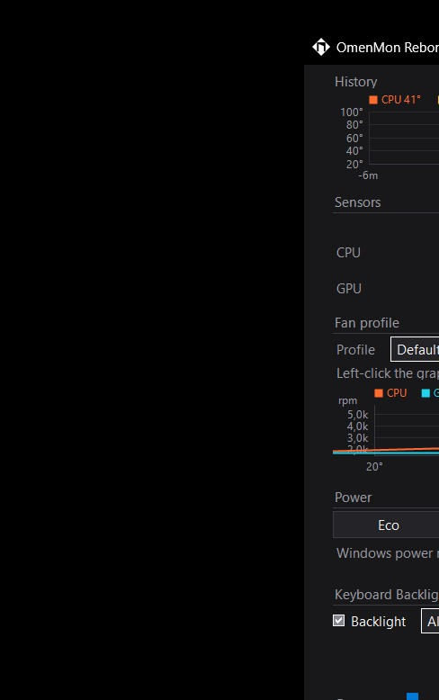

# OmenMon Reborn 8BCA

Fan control, power profiles and temperature monitoring for one specific HP OMEN laptop,
where the manufacturer's own software and the general-purpose tools all get it wrong.

**One profile switch sets everything at once** — fan curve, CPU power limit, GPU power
cap and the BIOS performance mode — instead of leaving them scattered across OMEN Gaming
Hub, the Windows power settings and a separate fan utility that disagree with each other.
Silent, Default and Performance are complete power states, not just three fan speeds.

<p align="center">
  
</p>

---

## ⚠️ Read this before installing

**This build is tuned for exactly one machine:**

| | |
|---|---|
| Model | HP OMEN Gaming Laptop **16-xf0079ng** (product **84S07EA**) |
| Motherboard | **`8BCA`** |
| CPU | AMD Ryzen 9 7945HS (or the 7840HS in the same chassis) |
| GPU | NVIDIA **GeForce RTX 4070 Laptop** (140 W, Optimus / hybrid graphics) |
| BIOS | F.31 / F.32 |
| OS | Windows 10 or 11, 64-bit |

**Check your motherboard before you install anything.** Open PowerShell and run:

```powershell
Get-CimInstance Win32_BaseBoard | Select-Object Product
```

**If that does not print `8BCA`, do not use this build.** Use
[OmenMon-Reborn](https://github.com/seakyy/OmenMon-Reborn) instead — it detects unknown
hardware and configures itself safely. This fork is the opposite: every value in it was
measured on one laptop and hard-wired.

### Why it can actually damage another laptop

This is not boilerplate. Four things stack up:

1. **The safety net was removed.** Upstream's auto-calibration wizard, which probes
   unknown hardware and works out a safe configuration, is deleted here — it produced
   confidently wrong answers on this board. Nothing now catches a wrong guess.
2. **The fans are set to run slowly.** *Silent* is the default: a 1700 rpm floor with
   no increase until 52 °C, measured as safe on *this* chassis and cooler.
3. **The CPU temperature may read wrong, and the fans follow it.** It comes from the
   AMD die sensor; without one it falls back to the laptop's sensor, which on some HP
   boards reports a number that never changes. A curve driven by a temperature that
   cannot rise never spins the fans up.
4. **The GPU temperature has to come from the GPU.** This laptop's own GPU sensor read
   33 °C while the die was at 76 °C, so this build asks the NVIDIA driver instead —
   a source that does not exist on an AMD or Intel GPU.

Quiet fans, a temperature that cannot rise, and no calibration to notice: that is the
combination, and 3 and 4 are each sufficient on their own. CPU power limits are set
here too (30-54 W sustained, up to 190 W peak), chosen for this processor.

Even on the right board this talks directly to undocumented hardware, with no warranty
of any kind — see the licence. If the fans ever behave strangely, set the profile to
**Performance** and reboot; the firmware takes fan control back by itself after about
two minutes.

---

## Installation

### 1. Install PawnIO

OmenMon needs kernel-level access to read sensors and set fan speeds. It uses
**[PawnIO](https://pawnio.eu/)** for this — a small, Microsoft-signed driver, so
Windows Defender will not object to it.

Download and run the installer from **<https://pawnio.eu/>**. Nothing to configure.

### 2. Download this program

Take the latest zip from the [Releases](../../releases) page and unpack it anywhere you
like — for example `C:\Program Files\OmenMon Reborn 8BCA`. There is no installer.

### 3. Run it as administrator

Right-click `OmenMon.exe` → **Run as administrator**. Reading the sensors and setting
fan speeds both require it; without administrator rights the program starts but shows
nothing useful.

To have it start automatically with Windows, tick **Start with Windows** at the bottom
of the window. It registers a scheduled task, which is what lets it start elevated
without a prompt every time.

### Requirements, in full

| | |
|---|---|
| Operating system | Windows 10 or 11, 64-bit |
| Driver | [PawnIO](https://pawnio.eu/) — required |
| Runtime | .NET Framework 4.8 (already present on Windows 10 1903 and later) |
| Rights | Administrator |
| Smart App Control | must be **off** — see below |
| Hardware | HP OMEN 16-xf0xxx, motherboard `8BCA` — see the warning above |

**Smart App Control blocks this program.** It is on by default on many new Windows 11
machines, and it refuses to launch anything that is not signed by a certificate it
already trusts — which no self-built or small open-source binary is. The symptom is
*"This app has been blocked by an application control policy"* with nothing in Windows
Security to click. Turn it off under **Settings → Privacy & security → Windows Security
→ App & browser control → Smart App Control**. Note that Windows only lets you switch it
*off*; turning it back on later requires resetting Windows, so decide deliberately.

### Close HP's own software

OMEN Gaming Hub controls the same fans through the same interface. Running both at once
means they fight over it. Close it, or set it not to start with Windows.

---

## Using it

**History** — the last ten minutes of temperatures and fan speeds. Useful for seeing
whether the fans actually respond when the machine heats up.

**Sensors** — current fan speed in rpm and temperature in °C. Both temperatures are read
from the processors themselves — the AMD die sensor and the NVIDIA driver — not from the
laptop's own sensors, which were measured against them and found to be wrong.

**Fan profile** — three profiles to choose from:

| Profile | For | GPU power |
|---|---|---|
| **Silent** | Everyday use. Fans hold 1700 rpm until 65 °C, then rise gently. | **limited to 80 W** |
| **Default** | A middle setting; fans come up earlier. | full 140 W |
| **Performance** | Gaming and sustained load. Loud, and the coolest. | full 140 W |

**The profile changes more than fan speed.** Silent also caps the graphics card at
80 W instead of 140 W — roughly half its power. That is deliberate (it is what makes
silence possible) but it is easy to miss, so if a game feels slow, check which profile
is active. Confirmed against the driver's own reported limit, not inferred.

Pick one and it applies immediately. The graph below shows that profile's curve, and you
can edit it directly: **left-click** to add a point, **drag** to move one,
**right-click** a point to remove it. Press **Save curve** to keep the change. **+**
adds a profile of your own; the three above cannot be deleted.

The number at the right (`120"`) counts down the firmware's own timer. The program keeps
resetting it — that is normal, and it is why the fans revert to automatic if the program
stops.

**Power** — the second half of the integration, and the reason a profile switch here
does what three separate tools normally do. One click sets the Windows power overlay and
all three CPU power limits together, so they cannot contradict each other:

| Preset | Windows mode | PL1 sustained | PL2 boost | PL4 peak | Character |
|---|---|---|---|---|---|
| **Eco** *(default)* | Best efficiency | 30 W | 45 W | 90 W | quietest and coolest, longest battery |
| **Balanced** | Balanced | 45 W | 65 W | 140 W | the stock 45 W TDP |
| **Performance** | Best performance | 54 W | 80 W | 190 W | the full 54 W cTDP ceiling |
| **Custom** | derived | 25–54 W, yours | ×1.45 | ×3 | mode follows the wattage |

*Custom* takes a single number — the sustained wattage — and derives the boost and peak
limits and the Windows mode from it, rather than letting you set four values that
disagree. Below 35 W it selects Best efficiency, from 50 W upward Best performance.

Between this panel and the fan profile above, the four things that actually determine
how hot and how loud the machine runs — **CPU wattage, Windows power mode, GPU power cap
and fan curve** — are set in one place and remembered together. That is the point of
this build: OMEN Gaming Hub sets some of them, Windows sets another, a fan utility sets
the last, and none of them tells the others.

**Keyboard Backlight Colour** — pick a zone (or *All zones*), set the colour with the
sliders, and **Save** it under a name.

**System Status** — motherboard, BIOS date, power state and current readings. The text
can be selected and copied, which is what to include in a bug report.

Everything you set is remembered and reapplied at the next start.

---

## If something goes wrong

**The fans are stuck loud, or stuck off.** Choose a different profile. If that does not
help, close the program and reboot — the firmware takes fan control back by itself after
about two minutes.

**"Failed to acquire embedded controller exclusive lock."** Something else is talking to
the same hardware, usually OMEN Gaming Hub. Close it. The message names the program it
was competing with, and is written to `OmenMon-error.log` next to `OmenMon.xml`.

**The GPU temperature looks frozen, or too high after gaming.** It was, and it is
fixed — the program now notices when the graphics card has powered down behind its
back and re-reads it. If you still see it stick, the details are in finding 5 below and
each occurrence is logged as `Nvml.Stale`.

**Another monitoring tool is open (Core Temp, HWiNFO, Ryzen Master).** Close it. They
read the same CPU sensor through the same system-wide lock, and a collision can leave
this program without a CPU temperature. It recovers by itself, and hands the fans back
to the firmware if it cannot — but the firmware runs the fans conservatively, so you do
not want to be there.

**Temperature or fan speed shows nothing.** Almost always PawnIO not being installed, or
the program not running as administrator.

**Anything else.** Every error window has a **Copy** button that puts the whole report,
including your motherboard and BIOS version, on the clipboard. Paste that into an issue.

Logs are written next to `OmenMon.xml`: `OmenMon-error.log` for faults,
`OmenMon-telemetry.csv` for the temperature and fan-speed history.

---
---

# Technical notes

*Everything below is for people working on the code, or adapting it to a different
laptop. You do not need any of it to use the program.*

## The findings

### 1. Fan control was never broken

Long-standing reports — an LKML thread, an HP community thread — say HP's WMI thermal
interface is firmware-broken on board `8BCA`, with `GTPS`, `RDCF`, `WHCM` and `WMAA`
returning `AE_NOT_FOUND`, and conclude that fan control must go through direct EC
register writes instead.

**That is not what happens on this machine under Windows.** A trace of every
`Bios.Send()` call (`OMENMON_BIOSTRACE=1`, see `Hardware/Bios.cs`) shows the fan
commands succeeding:

```
cmd=0x20008 type=0x2E in=[37 37 00 00] rc=0      SetFanLevel, both fans to 55
```

`rc=0` on every call. Confirmed acoustically too: a microphone measurement across a
level sweep gave −45 → −40 → −37 dBFS, so the fans really do respond.

Switching this fork to EC-based fan control — which those reports imply is necessary —
made things *worse*: fans went inaudible and the UI became laggy. That change was
reverted. **On Windows, use the WMI path.** The Linux reports are not wrong about
Linux; they simply do not describe the Windows driver stack.

Cost of getting this wrong: a day. If you are diagnosing a similar board, trace the
calls before believing a diagnosis written for a different operating system.

### 2. Fan RPM: `0xB0`/`0xB2` is not a tachometer here

`AutoCal.KnownBoards["8BCA"]` mapped fan speed to EC `0xB0`/`0xB2`, read as
little-endian 16-bit. On this board those registers read `0x005C` and `0x0000` —
"92 RPM" and "0 RPM" — and never move with load.

The working mapping is `BiosLevelMirror` with a ×100 multiplier, because fan *level*
is already expressed in units of 100 RPM:

```csharp
["8BCA"] = new Mapping {
    CpuReg = 0, CpuMode = EcDiffScanner.Mode.BiosLevelMirror, CpuMul = 100,
    GpuReg = 0, GpuMode = EcDiffScanner.Mode.BiosLevelMirror, GpuMul = 100,
},
```

This yields 4000/4300 RPM under load, matching what the machine sounds like.
Independently corroborated by
[arfelious/omen-fan-control#14](https://github.com/arfelious/omen-fan-control/issues/14),
which reports the same board idling near 2000 RPM and reaching ~6100 under load,
through a code path that returns `fan_data[fan] * 100`.

### 3. CPU temperature: the EC returns text, not numbers

This one cost the most time, and is the most likely to bite another board.

**Every EC and WMI CPU-temperature source on `8BCA` returns firmware string data.**
Not a broken sensor — bytes of an ASCII string sitting where a register is expected.
Every CPU temperature this machine ever reported was ASCII punctuation:

| Reported "°C" | Byte | Character |
|---|---|---|
| 33 | `0x21` | `!` |
| 42 | `0x2A` | `*` |
| 43 | `0x2B` | `+` |
| 44 | `0x2C` | `,` |
| 45 | `0x2D` | `-` |
| 54 | `0x36` | `6` |

Confirmed at four separate locations: `0x57` (CPUT), `0xB0`/`0xB2` (tachometer),
`0x95` (mode register, reads `0x43` = `'C'`), and the WMI `GetTemperature` (`0x23`)
call itself. `ModeReg = 0x59`, taken from Linux's `omen_v1_thermal_params`, reads a
constant 0 — also wrong for this board.

The trap is that the values look plausible. 44 °C at idle is believable, which is why
this survived so long. It was only disproven by a burn-in: OmenMon read **44 °C while
the die was at 66.8 °C**, and **33 °C while the die was at 48.5 °C**. A handful of
idle samples had looked like agreement, and were not.

**If you take one thing from this document:** never validate a temperature sensor at
idle. Load the machine and check that the reading *moves with* an independent one.

#### The fix: read the die directly

OmenMon reaches hardware through [PawnIO](https://pawnio.eu/) and loads exactly one
module — `LpcACPIEC`, which whitelists ACPI EC ports `0x62`/`0x66` and nothing else.
With every source behind those ports returning string data, there was nothing left to
read. `Driver/Ring0.cs` exposes `ReadPciConfig`, but it is a no-op stub.

The CPU itself still knows. Zen publishes `THM_TCON_CUR_TMP` on the SMN (System
Management Network) at `0x00059800`, reached through PCI configuration indices
`0x60`/`0x64`. `Resources/PAWN_BUILD.md` already documents the way there: load a
*second* officially-signed module.
[`AMDFamily17.bin`](https://github.com/namazso/PawnIO.Modules) exports
`ioctl_read_smn` — one `ulong` in, one out — and is the module LibreHardwareMonitor
uses for Ryzen Tdie. The `LpcACPIEC.bin` already shipped here is byte-identical to the
one in release 0.2.11, so taking `AMDFamily17.bin` from that same release requires no
new trust and keeps the driver Microsoft-signed.

Decoding, as in LibreHardwareMonitor's `Amd17Cpu`: bits 31:21 hold the reading in
1/8 °C steps, and either select bit means the scale is shifted down by 49 °C.

Verified on this machine against Core Temp:

```
raw 0x530B0000 -> 34.00 °C        raw 0x4E4B0000 -> 29.25 °C
                                  (Core Temp read 28 °C at that moment)
```

Two checks worth repeating on your own board: the raw values fall by `0x04C00000` per
4.75 °C — `2^24` per degree — which confirms the bits-31:21 / 0.125 °C scale; and
`RANGE_SEL` really is set here (`0x0B` in the third byte puts bit 19 high), so the
−49 °C shift applies. Skip that shift and the CPU appears to idle at 83 °C.

Implementation: `Driver/PawnIoAmd.cs`. It self-probes on open and disables itself if
the value is implausible, so on a non-AMD machine or without PawnIO it simply stays
unavailable and the EC path is untouched.

One consequence: Zen boosts on any brief foreground task, so the raw die reading
spikes ~30 °C for a single sample at idle. The EC value had been smoothed in firmware.
A median-of-3 is applied before the value reaches the fan programs, or the curves
chase every transient.

### 4. The GPU sensor does not track the GPU either

`GPTM` (EC `0xB7`) had been assumed good, because the fan curves appeared to work and
the idle number looked sensible. Both of those are the same trap as finding 3, and it
was never actually tested under load. It is now.

An RTX 4070 Laptop was held at 100% utilisation and ~79 W with a WebGL fragment-shader
load, with `nvidia-smi` as the independent reference:

| time | GPU die | OmenMon `GPTM` | delta | CPU | **max() the fan curve used** |
|---|---|---|---|---|---|
| 18:39:18 | 51 °C | 26 °C | −25 | 30 °C | 34 °C |
| 18:40:22 | 65 °C | 28 °C | −37 | 48 °C | **48 °C** |
| 18:41:28 | 75 °C | 33 °C | −42 | 62 °C | 62 °C |

The die rose 42 °C (34 → 76); `GPTM` moved 7 °C. It is not a fixed offset — **the gap
widens as the GPU heats**, from 25 to 42 °C, which is the signature of a sensor reading
somewhere far from the die with a large thermal lag. Unlike `CPUT` it is not string
data; it is a real sensor that is simply useless for this purpose.

**Why this is worse than finding 3.** Fan programs run on `max(CPU, GPU)`. At 18:40:22
that maximum was 48 °C — below the Silent profile's 52 °C threshold — while the GPU sat
at 65 °C on 79 W. **The fans stayed at the 1700 rpm floor.** In this test the CPU
eventually rose enough to trigger the fans, but only because a browser was driving the
load. A GPU-heavy, CPU-light workload — which is to say a game — never gets there.

The fix is the same shape as the CPU one: ask the part itself. `nvml.dll` ships with the
NVIDIA driver, sits in `System32`, is what `nvidia-smi` itself calls, and needs neither
a kernel driver nor elevation. `Driver/Nvml.cs` reads `nvmlDeviceGetTemperature` and
self-disables if the library is missing or the value is implausible.

Deliberately **not** median-filtered, unlike the CPU: NVML already reports a stable die
temperature with none of Zen's boost spikes, and smoothing would delay a rise — the
wrong direction to err for the part that was just shown to under-report.

---

### 5. And when the GPU parks, that reading freezes — while still reporting success

> **This one is not board-specific.** Everything else in these notes is about EC
> registers on motherboard `8BCA` and stops at this laptop's edge. This finding is
> about NVML and NVIDIA Optimus, so it should hold on **any RTX 40-series laptop with
> hybrid graphics** — and quite possibly on 30- and 50-series too, since the mechanism
> is the dGPU power-down, not the silicon. If you maintain a fan tool, a monitoring
> overlay, or anything else that holds a long-lived NVML session and reads temperature
> from it on a laptop, this affects you. The detector and the recovery are four lines
> each and are quoted in full below.

Finding 4 was only half of it. Reading the die solved the *accuracy* problem and
created a *liveness* one, which took considerably longer to pin down because it does
not look like a fault from the inside.

This laptop is hybrid-graphics. The moment nothing needs the discrete GPU, rendering
moves to the integrated Radeon and the RTX 4070 powers down. An NVML session that was
open across that transition does not notice. `nvmlDeviceGetTemperature` keeps returning
**the last value it recorded, with `NVML_SUCCESS`**, for as long as that session lives.
Not an error, not a zero, not a stale flag — a plausible number.

It was first seen as a reading stuck at 76 °C long after a load test had ended, with
the die actually at 38 °C. That direction is merely noisy: it holds the fans up. The
dangerous case is the same mechanism after the GPU has already cooled, where the frozen
value is *low* and the fans stay down into the next load.

Measured properly — 10 s of GPU load, then 60 s of complete silence with nothing
touching NVML, because *any* read wakes the GPU and destroys the measurement:

| cycle | NVML said | truth (`nvidia-smi`) | error | recovered within 30 s of polling? |
|---|---|---|---|---|
| 1 | 60 °C | 41 °C | +19 | no (150 consecutive reads) |
| 2 | 62 °C | 44 °C | +18 | no |
| 3 | 67 °C | 42 °C | +25 | no |
| 4 | 69 °C | 42 °C | +27 | no |
| 5 | — | — | — | recovered immediately |

Four of five froze, and none of the four ever recovered on its own. Polling harder does
not help and is in fact the reason an early attempt at this measurement failed
completely: sampling once a second kept the GPU awake, the pstate never left P0, and
the state under test never occurred. Observing it prevented it.

**What does not work as a detector.** Not the temperature itself: a stale value is the
last one seen under load, so it sits at 60–69 °C, and a GPU genuinely pinned under
sustained load produces an identical sequence. An earlier guard here counted repeated
identical readings and distrusted long runs below 60 °C — it could never fire, because
the values it needed to catch were above its own threshold. Nor power (590 W of
nonsense), nor the clock (1320 MHz against a true 1980), nor the pstate (P0 in both
states), nor the utilisation *value* (0 % when parked and 0 % when stale).

**What does work.** The *return code* of `nvmlDeviceGetUtilizationRates`. It is the one
call that refuses to serve a cached answer: in the stale state it returns **999**
(`NVML_ERROR_UNKNOWN`) while every other field cheerfully returns 0 with a wrong number.

```
under load : 61 °C, util 94%, 79.7 W, P0, 2430 MHz
OLD session: 60 °C, util  0%, 590.0 W, P0, 1320 MHz   ← hr 0 / 999 / 0 / 0 / 0
NEW session: 41 °C, util  0%,  12.3 W, P0, 1980 MHz
nvidia-smi : 41 °C, util  0%,  12.3 W, P0, 1980 MHz
```

**The recovery is in-process.** `nvmlShutdown()` followed by `nvmlInit_v2()` restores a
correct reading immediately — confirmed twice, exactly: 41 against a true 41, 44 against
a true 44. No external process is involved. This also explains an earlier red herring:
running `nvidia-smi` appeared to "fix" the reading, and it does, but only because it is
a *fresh* session. An existing one cannot wake the GPU no matter how often it asks.

In full, for anyone who wants to drop it into their own tool:

```c
// Detect: the only call that refuses to serve a cached answer.
nvmlUtilization_t util;
bool live = (nvmlDeviceGetUtilizationRates(dev, &util) == NVML_SUCCESS);
//         ^ the return code, not util.gpu — a parked GPU reads 0% either way

// Recover: rebuild the session, then re-acquire the handle.
if (!live) {
    nvmlShutdown();
    if (nvmlInit_v2() == NVML_SUCCESS)
        nvmlDeviceGetHandleByIndex_v2(0, &dev);
}
```

Rate-limit the rebuild — one per 10 s here — or a permanently broken driver turns it
into a re-init loop. And check liveness *before* trusting the temperature on that tick,
not after: the point is never to act on the stale value at all.

`Driver/Nvml.cs` therefore tests liveness on every read and rebuilds the session on the
tick it goes stale, rate-limited to one rebuild per 10 s so a permanent fault cannot
turn into a re-init loop. Each rebuild is written to `OmenMon-error.log`.

**And if even that fails**, the fan side takes over, because falling back to `GPTM` at
this point would be the worst possible move — it reads about 28 °C under a 79 W load, so
taking it would look like the GPU had suddenly gone cold and would drop the GPU fan at
the exact moment the reading was lost. Instead `Platform` holds the last die value and
marks it untrusted, and `FanProgram` eases the GPU fan down **one step (100 rpm) per
2 s tick to a 2500 rpm floor**, where it stays until a trustworthy reading returns. Not
frozen loud, not dropped silent: the GPU finishes cooling on the way down, and a
permanently dead sensor still leaves the card ventilated.

---

### 6. When the CPU reading dies, hand the fans back to the firmware

The same class of problem on the CPU side, with a different cause and a different fix.

Reading Tdie goes through the cross-process `\BaseNamedObjects\Access_PCI` mutex.
Anything else polling the same AMD SMN register — Core Temp, HWiNFO, Ryzen Master —
can make a read fail. That is exactly what happened here: **Core Temp was running**, and
raising this program's poll rate from 15 s to 2 s, with each tick reading SMN twice,
made collisions likely. There was no retry, so the first collision was permanent.

The consequence was not a missing number. `GetCpuTemperature` fell through to `CPUT`
(EC `0x57`), which is firmware *string* data — see finding 3 — plausible-looking and
unable to rise. The curve then ran on it, and **the CPU passed 90 °C with the fans at
their 1700 rpm floor**.

Two changes. `PawnIoAmd` now retries, and reopens the module after three consecutive
failures. And `Platform` publishes `IsCpuTemperatureTrusted`, on which `FanProgram`
stops extending the EC countdown at `0x63` — after which the firmware resumes fan
control by itself in about 120 s.

Handing back is what other implementations do. `thinkpad-acpi` carries a fan watchdog
the kernel documentation describes as being there "to make sure the fan is never left
set to an unsafe level because of userspace problems", and re-enables firmware control
on expiry. Framework's EC has `autofan` for the same reason. NBFC's porting guide tells
config authors to find the register value that returns control to the EC firmware. The
firmware's own curve is the one thing guaranteed safe without this software running.

**Known limitation:** the firmware's curve is conservative, and in testing "auto" let
the CPU reach 94 °C under sustained all-core load. Handing back is the safe *failure*
mode, not a good operating mode — the real fix is not to lose the reading, which is why
the retry above matters more than the hand-back does.

---
## Other things learned about this board

- **Fan programs apply as step functions, not interpolated ramps.**
  `GetTemperatureLevel` picks the highest threshold at or below the current
  temperature, so a "curve" with sparse points is a staircase. Put points where you
  want the steps.
- **Fan levels are in units of 100 RPM.** Level 18 is 1800 RPM. The practical floor on
  this chassis is around 1700; below that the fans stall rather than spin slowly.
- **Each fan now follows its own component, not `max(CPU, GPU)`.** Upstream picks one
  level from the higher of the two temperatures and applies it to both fans. This fork
  looks the level up twice and gives the CPU fan the CPU's row and the GPU fan the
  GPU's. Verified independently in both directions: GPU at 68 °C drove the GPU fan to
  3800 rpm while the CPU fan stayed at 2000; CPU at 66 °C drove the CPU fan to 3700
  while the GPU fan stayed at 2500.
- **The EC lock contender is often something you did not think of, and the log used to
  hide it.** `Global\Access_EC` is held for a whole `EcExecBatch` sensor pass, and
  `Ec.cs`'s read backoff `Wait()`s while holding it, so a single 600 ms attempt from
  the UI thread loses. Acquisition now retries across a budget (`EcMutexTotalTimeout`,
  default 2500 ms). **Correction to an earlier version of this note:** it said the lock
  was "usually contended by OmenMon itself" and that no competing process was found.
  That was a reporting bug, not a measurement — `EcContenderNames` matched process
  names exactly, so `OmenCap` and `HPSystemEventUtilityBackground` were running the
  whole time and reported as "none detected". Matching is now by substring.
- **Fan programs have no hysteresis**, and re-evaluate every `UpdateProgramInterval`
  seconds — **2 s** here, down from the 15 s default, which was far too slow to catch a
  rise. `GetTemperatureLevel()` is a bare binary search with no dead band, so a
  temperature resting on a threshold flips the fan between two levels every tick. This
  is the second reason curves need dense points: at 14 °C spacing that is a ~1000 rpm
  pump every couple of seconds, at 2 °C spacing it is 200 rpm and inaudible.
- **Each profile sets `<GpuPower>`, and Silent sets `Minimum`** — 80 W against the
  card's 140 W maximum, confirmed by `power.default_limit` vs `enforced.power.limit`.
  Switching profile changes the GPU power budget as well as the fans. It also means
  Silent's curve only ever has to cope with an 80 W GPU, a much milder worst case than
  Performance's.
- **Measured anchors at 80 W GPU:** the 1700 rpm floor leaves the die at 76 °C and
  still climbing; 3800 rpm holds it at ~68 °C. Enough to choose a target temperature
  rather than guess at rpm.
- **Generating GPU load in a browser has three traps.** WebGL is capped by frame
  presentation and reaches only half the power of a WebGPU compute loop; Chromium
  throttles `requestAnimationFrame` on an occluded window, which silently ends a load
  mid-test; and running compute and rendering together reset the GPU driver twice at
  the same ~15 s mark, at two very different load sizes. Compute alone sustains 98%.
  ~80 W is the honest browser ceiling on a 140 W card — the rest needs a real 3D
  application. The harness is in `docs/`.
- **The monitor thread starves under sustained full load** — 2 telemetry samples in
  15 minutes was observed — which also thins out `CheckThermalPanic`. Not yet fixed.
- **Burn-in result:** peak **73.2 °C** after ~15 minutes of all-core load on the
  Silent profile, comfortably below the 90 °C limit.
- **HP reuses ProductId `8BCA` across CPU and regional variants with conflicting EC
  layouts** (upstream issues #76/#85/#114/#142 are deferred for this reason).
  Everything above is specific to *this* machine.

---

## What changed in the application

| Area | Change |
|---|---|
| **CPU temperature** | AMD Tctl/Tdie over SMN via a second PawnIO module, median-of-3 smoothed (`Driver/PawnIoAmd.cs`) |
| **GPU temperature** | NVIDIA die temperature via `nvml.dll` — no kernel driver, no elevation. Unsmoothed, so a rise is never delayed (`Driver/Nvml.cs`) |
| **GPU sensor liveness** | Every read tests the NVML session with `nvmlDeviceGetUtilizationRates` and rebuilds it when it has gone stale, so a parked GPU can no longer freeze the reading at a wrong value (finding 5) |
| **Untrusted-sensor fallbacks** | CPU: fans handed back to the firmware. GPU: the last die value is held rather than falling through to the useless EC sensor, and the fan eases to a 2500 rpm floor instead of dropping (`Hardware/FanProgram.cs`) |
| **Fan RPM** | `BiosLevelMirror` ×100 mapping for `8BCA` (`Library/AutoCal.cs`) |
| **Fan profiles** | Reduced to Performance / Default / Silent, with `+` to add. The three standard ones cannot be deleted. Selecting one applies immediately — no second click, no hysteresis wait |
| **Fan curve** | Inline editable: left-click adds a point, right-click removes one, drag to move (`App/Gui/GuiCurveEditor.cs`) |
| **Live graph** | 200-sample rolling temperature and RPM history with real axes, dropout bridging and spike filtering (`App/Gui/GuiChart.cs`) |
| **UI** | Dark throughout, including the DWM title bar; tray context menu replaced by in-window controls (`App/Gui/GuiTheme.cs`, `External/Dwm.cs`) |
| **Power** | Windows power mode overlay and CPU wattage as a single selector, with custom wattage derived so it stays consistent with the chosen profile (`Library/UserPrefs.cs`, `External/PowrProf.cs`) |
| **Persistence** | Applied settings survive a restart via an `OmenMon-user.conf` sidecar (`Library/UserPrefs.cs`) |
| **Telemetry** | `OmenMon-telemetry.csv`, written on a heartbeat so logging continues with the window closed (`Library/TelemetryLog.cs`) |
| **Errors** | Selectable, copyable error dialog carrying board, BIOS, OS and the full exception chain; everything shown to the user is also appended to `OmenMon-error.log` (`App/Gui/GuiFormError.cs`) |
| **Config saving** | Written to a temporary file and swapped in, so a failed save cannot leave a half-written `OmenMon.xml` |
| **Icons** | Monochrome and flat: white OMEN diamond, black mark, black temperature digits, no outline |
| **Calibration** | Auto-calibration and its sidecar removed — on this board it produced confidently wrong mappings |

The assembly name stays `OmenMon`. `Config.AppName` derives the settings-XML root
element `<OmenMon>`, the scheduled-task names and the mutex names from it, so renaming
it would orphan an existing configuration. Only the display identity changes, through
`Config.DisplayName`.

## Build

```
msbuild OmenMon.csproj /p:Configuration=Release /p:Platform=x64
```

## Diagnostics

| Command | What it gives you |
|---|---|
| `OmenMon.exe -Diag` | Live fan telemetry: active register, mode, multiplier, BIOS fan count |
| `OmenMon.exe -Probe` | WMI + BIOS + EC snapshot as Markdown |
| `OmenMon.exe -Ec` | Live EC monitor |
| `OMENMON_BIOSTRACE=1` | Logs every WMI `Send()` with its arguments and return code |

## Adapting this to your own laptop

The method, in the order that actually worked:

1. **Trace before theorising.** `OMENMON_BIOSTRACE=1` shows whether the WMI calls
   return `rc=0`. A day was lost here to a Linux bug report describing a different
   driver stack.
2. **Dump the EC across a load sweep** and look for bytes that *move with* load and
   return to idle. Bytes that hold constant, or sit in the ASCII printable range, are
   string data.
3. **Never validate a sensor at idle.** Load the machine and compare against an
   independent reading — Core Temp, HWiNFO, a thermocouple. Idle agreement is not
   agreement.
4. **A microphone is a real instrument.** A phone mic will tell you whether the fans
   responded to a command. Turn off the microphone's noise suppression first: Windows
   "audio enhancements" cancel steady fan noise, which pinned readings at the noise
   floor until it was disabled.
5. **When the EC has nothing usable, go around it.** The CPU, GPU and PCH all publish
   their own sensors. PawnIO has signed modules for MSR, SMN, PCI config and LPC; the
   table in `Resources/PAWN_BUILD.md` says which module covers what.

`CLAUDE.md` holds the machine-specific detail in the form an AI coding assistant can
act on, including the theories that turned out to be wrong and how they were
disproven.

---

## Danksagungen · Credits

This project is three layers of other people's work. In order:

**[Piotr Szczepański](https://github.com/OmenMon)** — author of the original
[OmenMon](https://omenmon.github.io/). The WMI BIOS interface, the EC access layer,
the fan program engine, the keyboard backlight control, the localisation system and
the tray application are all his. Everything here rests on that foundation, and the
architecture held up under changes he never anticipated. Licensed GPL-3.0.

**[seakyy](https://github.com/seakyy)** — author of
[OmenMon-Reborn](https://github.com/seakyy/OmenMon-Reborn), which replaced the
hardcoded 2023 EC layout with an XML-driven model database, added the heuristic
auto-detector and the `AutoCal.KnownBoards` table, and migrated the driver from
WinRing0 to PawnIO. Without the `KnownBoards` mechanism there would have been nowhere
to put the `8BCA` fan-RPM fix. Consider
[buying them a coffee](https://buymeacoffee.com/seakyy).

**[namazso](https://github.com/namazso)** — [PawnIO](https://pawnio.eu/) and
[PawnIO.Modules](https://github.com/namazso/PawnIO.Modules). A Microsoft-signed kernel
driver with signed, sandboxed modules is what makes hardware access on modern Windows
possible without a fight with Defender. The `AMDFamily17` module is what finally
produced a correct CPU temperature on this machine.

**[LibreHardwareMonitor](https://github.com/LibreHardwareMonitor/LibreHardwareMonitor)**
— `Amd17Cpu.cs` is the reference for the Zen SMN temperature register and its
decoding, including the −49 °C range-select shift.

**[arfelious/omen-fan-control](https://github.com/arfelious/omen-fan-control)** and
**[alou-S/omen-fan](https://github.com/alou-S/omen-fan)** — the Linux OMEN tools.
`alou-S`'s [`docs/probes.md`](https://github.com/alou-S/omen-fan/blob/main/docs/probes.md)
is the canonical EC register map, and issue #14 on `arfelious`'s tracker independently
corroborated the fan-RPM finding on this same board.

**[Core Temp](https://www.alcpu.com/CoreTemp/)** — the independent reading that
disproved the EC temperature and then confirmed the SMN one. A second opinion from a
tool sharing no code with yours is worth more than any amount of reasoning.

The hardware investigation, the diagnostic tooling and the code in this fork were
produced in a pair-programming session with
[Claude Code](https://claude.com/claude-code) (Anthropic).

---

## License

**OmenMon** Copyright © 2023-2024 [Piotr Szczepański](https://piotr.szczepanski.name/)
**OmenMon-Reborn** modifications Copyright © 2026 [seakyy](https://github.com/seakyy)
**8BCA fork** modifications Copyright © 2026 metamountain

This application is _free software_: you can redistribute it and/or modify it under
the terms of the
[GNU General Public License Version 3](https://www.gnu.org/licenses/gpl-3.0.html#license-text)
as published by the [Free Software Foundation](https://www.fsf.org/). The full text is
in [LICENSE.md](LICENSE.md); the GPLv3 change record is in
[MODIFICATIONS.md](MODIFICATIONS.md).

It is distributed **without any warranty** — without even the implied warranty of
merchantability or fitness for a particular purpose. It writes to undocumented hardware
interfaces; you run it at your own risk.

**OmenMon** builds upon the work of several other projects; see the
[acknowledgements](https://omenmon.github.io/more#acknowledgements).

_This software is not affiliated with or endorsed by HP. Any brand names are used for
informational purposes only._
